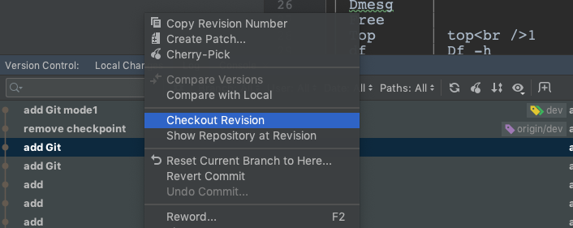
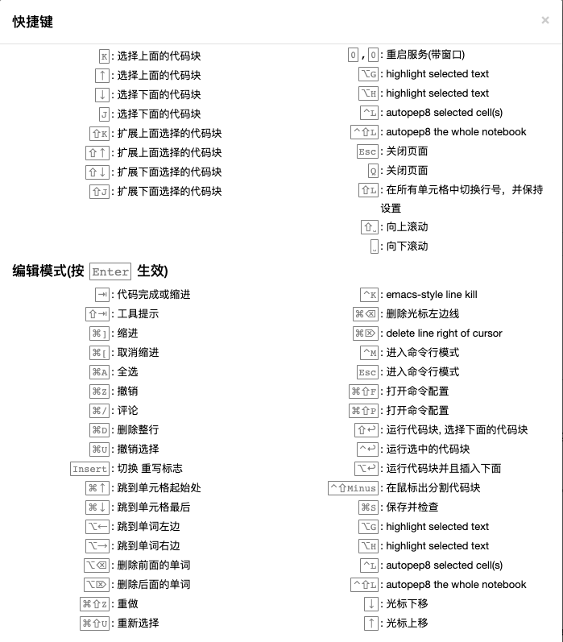

# Git
123

## 链接dev和origin/dev

## gitignore

## use case

1. 丢弃修改
   - `git checkout .`
2. 回复到最新一次的HEAD
   - `git reset HEAD`
3. 回复到指定的head
   - `git checkout [headID]`
4. 软硬复位head
   - `git reset --hard [HASH] ` 有可能会丢失head
   - `git reset --soft [HASH] `
5. 把内容存到stash
   - `git stash `
   - `git stash pop`恢复stash

# Pycharm+Git

## 底部菜单栏 Log

checkout revision可以把head 指定到这个位置

add an test img

