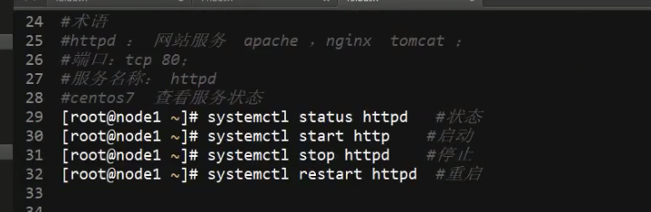

[TOC]


# useful command	

- echo $0: search for the default shell

- chmod [u,g,o] [+-=] [rwx] [file]

- Cat /etc/shells

- change VIM scheme: edit ~/.vimrc.  (refer to the file)

- edit ~/.zshrc; finally use zsh update modification.  (refer to the file)


## edit gitbash
https://juejin.im/post/5bd5a08cf265da0add520772#heading-5

## 5 ways to excute sh script 

`sh 01.sh` means use sh to execute 01


## variable of shell

- Name of variable cannot start with number or special characters

- types of variable

  - User defined variable
  - environment variable
  - Position variable
  - Predefined variable

- Output of variable

  - ```bash
    a=1
    echo $a
    ```


-  Environment variable
  - Already defined by sys
  
  - `env` search for the global variable
  
  - 
  
  - `Export` change the variable to global variable
  
  - position variable and pre-defined variable
    
    - 
    
  - Local variable and global variable
    - `env` show the global
    - `export` set the global, also can be used to show the global
    

## special operator and operator

###Operator: 

- `+ - * / %`

- `expr var1 operator var2`

- ```bash
  (base) ➜  example git:(master) ✗ A=10
  (base) ➜  example git:(master) ✗ B=20
  (base) ➜  example git:(master) ✗ expr $A+$B
  10+20
  (base) ➜  example git:(master) ✗ expr $A + $B
  30
  (base) ➜  example git:(master) ✗ expr $A \* $B
  200
  (base) ➜  example git:(master) ✗ expr $A / $B
  0
  (base) ➜  example git:(master) ✗ expr $A % $B
  10
  ```

  ```bash
  (base) ➜  example git:(master) ✗ abc=$(expr $A + $B)
  (base) ➜  example git:(master) ✗ echo $abc
  30
  ```

##filter the user IP

```bash
(base) ➜  example git:(master) ✗ ifconfig en0 |grep 'inet '
	inet 192.168.31.232 netmask 0xffffff00 broadcast 192.168.31.255
(base) ➜  example git:(master) ✗ ifconfig en0 |grep 'inet ' |awk '{print $2}'
192.168.31.232
(base) ➜  example git:(master) ✗ IPADDR=$( ifconfig en0 |grep 'inet ' |awk '{print $2}')
(base) ➜  example git:(master) ✗ echo $IPADDR
192.168.31.232
```

##`" "`

 used to reserve special operator and space

- ```bash
  (base) ➜  example git:(master) ✗ a=a b c
  zsh: command not found: b
  (base) ➜  example git:(master) ✗ a="a b c"
  (base) ➜  example git:(master) ✗ echo $a
  a b c
  ```

## `' '`

 represent the name of `$USER`, not its value. Regard the special character as a  general charactor .

- ```bash
  (base) ➜  example git:(master) ✗ a="user: $USER"
  (base) ➜  example git:(master) ✗ echo $a
  user: andrew
  (base) ➜  example git:(master) ✗ b='user: $USER'
  (base) ➜  example git:(master) ✗ echo $b
  user: $USER 
  ```

##\`\` 

====  `$()`  which can be used to execute one command insider of another command

## `read`

 interactive assignment. (Refer to user.sh)

- ```bash
  (base) ➜  example git:(master) ✗ read kernel
  123
  (base) ➜  example git:(master) ✗ echo $kernel
  123
  ```

## `test`or`[space space]`

 Condition judgment

- -d directory

- -e exist

- -f file

- -r read -w write -x execute

- ```bash
  (base) ➜  example git:(master) ✗ ls
  total 16
  -rw-r--r--  1 andrew  staff  117  7 11 20:52 01.sh
  -rw-r--r--  1 andrew  staff  291  7 13 17:08 user.sh
  (base) ➜  example git:(master) ✗ [ ! -f ./test ] && touch test1
  (base) ➜  example git:(master) ✗ ls
  total 16
  -rw-r--r--  1 andrew  staff  117  7 11 20:52 01.sh
  -rw-r--r--  1 andrew  staff    0  7 13 17:32 test1
  -rw-r--r--  1 andrew  staff  291  7 13 17:08 user.sh
  
  (base) ➜  example git:(master) ✗ [ ! -f ./test1 ] && echo "OK"
  (base) ➜  example git:(master) ✗ [ -f ./test1 ] && echo "OK"
  OK
  ```

## number comparison

 -eq -ne -gt -lt

- ```bash
  (base) ➜  example git:(master) ✗ user=1
  (base) ➜  example git:(master) ✗ echo $user
  1
  (base) ➜  example git:(master) ✗ [ $user -gt 5 ]&& echo $user
  (base) ➜  example git:(master) ✗ [ $user -ne 5 ]&& echo $user
  1
  ```

## string comparison

 =      !=      -z

- ```bash
  (base) ➜  example git:(master) ✗ sh lang.sh
  false:zh_CN.UTF-8
  (base) ➜  example git:(master) ✗ sh -x lang.sh
  + '[' zh_CN.UTF-8 '!=' en.US ']'
  + echo false:zh_CN.UTF-8
  false:zh_CN.UTF-8
  + '[' zh_CN.UTF-8 = en.US ']'
  ```

  ```bash
  #!/bin/bash
  #
  [ $LANG != en.US ] && echo "false:$LANG"
  [ $LANG = en.US ] && echo "true:$LANG"
  ```

## If

 condition judgment

###Single branch: 

- ```bash
  #!/bin/bash
  #test if
  
  if [ ! -f if01.txt ]
  then
      touch if01.txt
  fi
  ```

  ```bash
  !/bin/bash
  #this is if script
  
  SYS=`uname`
  KERNEL=`uname -r`
  
  if [ $SYS != Linux ]
  then
  echo "you sys is $SYS"
  echo "you kernel is $KERNEL"
  fi
  ```

###Double branch

```bash
 #!/bin/bash
#test if and else

ping -c 3 -i 0.2 -t 3  $1 >/dev/null

if [ $? -eq 0 ]
then
    echo "target is up"
else
    echo "target is down"
fi
```

### multiple branch

```bash
#!/bin/bash
#

read -p "Please enter a num: " NUM
echo "you entered is: $NUM"

if [ $NUM -gt 85 ] && [ $NUM -le 100 ]
then
    echo "bigger than 85"
elif [ $NUM -gt 65 ] && [ $NUM -le 85 ]
then
    echo "bigger than 65"
else
    echo "less than 65"
fi
```

### monitor HTTP

requirment :




installation:

`rpm -q httpd`

`rpm -y install httpd`

```bash
#!/bin/bash
#

systemctl status httpd >> /dev/null
if [ $? -eq 0 ]
then
    echo "Http is running"
elif [ $? -ne 0 ]
then
    echo "Http is stop! try to restart" >> /var/log/httperr.log
    read -p "restart?[y/n]" DO
    echo "  Your input is: $DO"
    if [ $DO == y ]
    then
        echo " restarting"
        systemctl restart httpd
    elif [ $DO == n ]
    then
        echo " script stop"
    else
        echo "wrong input"
    fi
fi
```

### maintenance command

`ls` show the files in the directory 

​	`-a` show the hidden file 

​	`-d` only show directory

`pwd` print work directory

`cd` change directory

​	`-` last dir

​	`..` parent dir

`date` show or set current time

​	`"+%Y-%m-%d %H:%M:%S"`	show

​	` -s` set `date -s "2022-10-09 20:22"`

`passwd` change password

`su` change user, default is root

​	`su - pi` change to user pi

`clear` clean the output of shell

`man` show the help doc

​	`man vim` detailed info

​	`vim --help` rough info