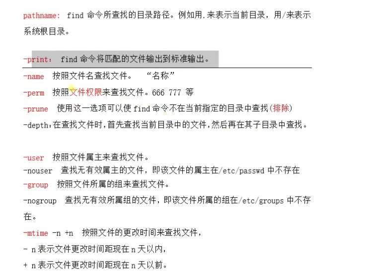
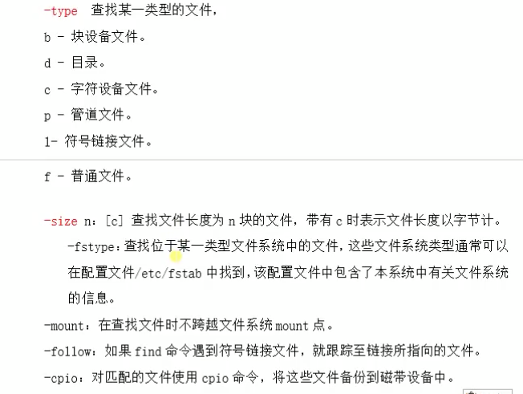
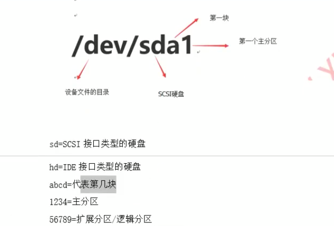

[TOC]

# Shell-command

| 命令     | 举例                                                         | 作用                                                         | 补充 |
| -------- | ------------------------------------------------------------ | ------------------------------------------------------------ | ---- |
| who am i |                                                              | 显示用户名字                                                 |      |
| Which    | which ls                                                     | 查看命令是否存在                                             |      |
| Whereis  |                                                              | 类似which                                                    |      |
| Locate   | Locate [file]                                                | 比较详细的显示                                               |      |
| pwd      |                                                              | 显示当前路径                                                 |      |
| cd       | cd ..                                                        | parent dictionary                                            |      |
|          | cd ~                                                         | user                                                         |      |
|          | cd /                                                         | root                                                         |      |
|          | Cd -                                                         | 上一个路径                                                   |      |
| ls       | ls -lh                                                       | 人性化显示                                                   |      |
|          | ls -a                                                        | 显示隐藏文件                                                 |      |
|          | ls -d                                                        | 当前这个目录                                                 |      |
| cat      | cat [test.txt]                                               | View a document                                              |      |
| Vim      | vim [test.txt]                                               | Edit a document. <br />for details, refer to other chapter   |      |
| Nano     | nano [test.txt]                                              | Edit a document using an lite tool                           |      |
| date     |                                                              | view and set the date                                        |      |
| clear    |                                                              | clear the history of ssh                                     |      |
| Man      | man [clear]                                                  | view the help document of [command]                          |      |
| Who      |                                                              | view the login user                                          |      |
| w        |                                                              | view the login user                                          |      |
| Uname    |                                                              | The name of operation system                                 |      |
| uptime   |                                                              | system usage                                                 |      |
| last     |                                                              |                                                              |      |
| Dmesg    |                                                              | 显示开机信息                                                 | n    |
| Free     |                                                              | Cpu info                                                     | n    |
| Top      | top<br />1                                                   | Cpu info                                                     |      |
| df       | Df -h                                                        | 查看磁盘大小                                                 |      |
| useradd  | -d home directory<br />-s shell<br />-g group<br />-G supplementary groups | - `useradd -d /opt/sam -s /bin/sh sam`<br/>- 查看user的组 `id sam`<br/>- 查看账号信息 `tail -1 /etc/passwd` |      |
| id       | id root                                                      | uid=0(root) gid=0(root) groups=0(root)                       |      |
| userdel  | -r del user+dict                                             | - `userdel -r test` 两个一起删除                             |      |
| usermod  | same as `useradd`                                            | 修改user信息                                                 |      |
| passwd   | passwd sam                                                   | 设置sam的密码<br />- `echo 123456 1 passwd --stdin sam`      |      |
| groupadd |                                                              |                                                              |      |
| groupdel |                                                              |                                                              |      |
| Chmod    | chmod 775 /test                                              | 修改文件夹权限                                               |      |
| tar      | tar -cvf archive.tar foo bar                                 | 创建一个归档                                                 |      |


# 硬件资源管理

## 硬件资源管理

- pci设备
  - 显卡 `dmesg |grep -i vga` -i指的是不区分大小写
  - 网卡 `lspci |grep -i eth`
  - 声卡 `lspci |grep -i vga`
- CPU信息
  - CPU `cat /proc/cpuinfo | grep 'pysical' |sort |uniq|wc -l`
- 内存
  - `free -m`
  - `cat /proc/meminfo`
- 磁盘分区
  - `fdisk -l` 分区情况
  - `df -h` 大小情况
  - `du -h` 使用情况

## 外设设备使用

- linux下的硬件设备都是以文件的形式存在
- 不同的硬件会有不同的文件类型
- 设备文件在/dev下

尝试挂载：

1. 用mount 去/dev/xxxx下挂载到/xxxx `mount /dev/sr0 /mnt`(目录，设备)
2. 查看挂载 `df`
3. 卸载 `umount /mnt`

# 软硬链接

## 硬链接

 `ln a.txt b.txt`

- 只针对文件，不针对文件件
- 不能夸分区
- 改了a，b也变了
- 删了a.txt 不影响b.txt

## 软链接

 `lb -s a.txt b.txt`

- 只针对名字链接
- a.txt删了，影响b
- 可以跨分区


# /文件目录
## /目录结构
- / 根目录，所有文件的开始，只有root用户可以更改
- /home 放置普通用户的目录
- /root root用户的家
- /dev 存放设备文件，硬件设备
- /usr 存放应用文件，安装软件
    - bin 二进制文件
    - etc 配置文件
    - include 引用的头文件，.h
    - lib 32位的库文件
    - src 核心程序的源代码
- /etc 系统管理的配置文件
    - host
    - resolv dns配置文件
    - cron 
    - profile 环境变量/全局变量
- /boot 启动文件
- /lib 动态.so/静态.a
- /var log file
- /temp 临时文件 
-/proc 虚拟映射 系统的信息
    - cpu
    - mem
    - filesystem
    - modules 加载的模块
    - stat 系统信息
- /bin 普通可执行命令
- /sbin 只有root能用的可执行命令
## 相对路径和绝对路径
绝对路径准确性高
- 绝对路径：
    - 从/ ~写起
- 相对路径：
    - ./ 当前文件夹
    - ../ 上一个文件夹


# 文件操作
## 查看

- cat
- nl
- more
- less
- head
- tail
## 文件创建/删除/移动/复制
- mkdir 创建文件夹
    - mkdir -m 777 test 设置权限
    - mkdir -p test/test1/test2 创建递归的文件夹
    - ll -d test
- touch 创建文件
    - echo 1234 > test.txt 覆盖
    - echo 1234 >> test.txt 追加
- rm 删除，-rf 删除文件夹
    - f 强制，忽略不存在
    - i interactive 交互式的
    - r recursive 递归的
- mv 移动
- cp 复制
    - f 强制
    - r 递归
## 文件隐藏属性
- chattr 设置隐藏属性
    - +/- 加/减一个特殊属性
    - +a 不能被删除。只能看，不能写。（只能加？）
    - +i 类似a
- lsattr


# 用户和组

## linux系统用户管理

- root: UID 0
- local: UID 1000+
- system  UID 1-1000

### 查看

- 查看用户 `vim /etc/passwd`
- 查看密码 `vim /etc/shadow`

### 添加用户

- useradd `useradd -d /opt/sam -s /bin/sh sam`
- 查看user的组 `id sam`
- 查看账号信息 `tail -1 /etc/passwd`

指定uid，指定起始组root，附加组ftp

- `useradd -u 2010 -g root -G ftp -s /bin/sh test`

### 删除用户

删除用户+删除宿主目录

- `userdel -r test` 两个一起删除

### 修改用户信息

- usermod 选项和useradd一致，-u

### 设置密码

- `passwd sam`
- `echo 123456 | passwd --stdin sam`

# 权限管理
权限分成三种类型
- 所有者
- 用户组
- 其他用户

-rw-r--r--                   1         andrew           staff 9.3K  6 16 10:25    01-07 基础  
文件的类型和权限 链接数  文件所属用户和组 大小 修改日期           文件名

## 权限
### 第一位
- d 目录
- l 软链接
- /- 文件
- c 硬件设备
- b 块设备，可存储

### 二三四位
- r read读
- w write写
- x execute执行

举例：  
-rwxr-----： 只能所有者rw  
-rwxr--r--：所有者可以rw，其他人可以r

### chmod
r-4 w-2 x-1 --0
- chmod 775 /test 改权限
    - chmod g+s /test 文件夹归到一个组
    - chmod u+s /test 文件归到一个用户
    - chmod o+t /test 粘滞位
- chown stu2:study /test 改组

### 特殊属性
设置属主和属组  
- suid： Set UID 用在文件和脚本  4
- sgid： Set GID 用在目录  2
- SBIT(sticky)粘滞位，一个组只能删自己的东西  1
- chmod 4775 /test 特殊属性也一起改


# 软件包管理

RPM软件包管理 redhat program manager

-i install

—nodeps 不需要依赖

-v verbose 详细信息

-h —hash 哈希进度条

`rpm -ivh [name.rpm]` install

`rpm -Uvh [name.rpm]` update

`rpm -e [zsh]` eliminate 

`rpm -e [zsh] --nodeps` eliminate, ignore dependence 

Rpmfind.net 网上下载安装包

rpm -qa [zsh] 查看是否安装

`rpm -qf  which zsh`查看是否安装

## 恢复文件

cpio通过重新定向的方式，将文件打包。可以解压`.cpio .tar`

## 创建本地yum仓库

Yum -y install http

Yum check-update

Yum remove

yum info

yum list

Yum groupinstall 'security tool'

## 源码包

源码编译安装，比较灵活

### 解压

tar -xzf [file]

- x 解包
- z 解压gzip。 j用于bz2
- v 显示过程verbose
- f 指定被解压的包名字
- C 指定解压的目录

### 配置

1. 进入目录
2. 用./configure [—prefix=/usr/local/filname]来配置。卸载的时候删除这个目录
3. make -j 4 编译，4核
4. Make install安装


# 文件输入/输出/重定向

linux一切都是文件，drive也是文件，键盘也是文件。

重定向：改变文件的输入输出方向

文件描述符：

- ulimit -n
- 0 stdin 
- 1 stdout
- 2 stderr
- 举例：echo 123456 | passwd —stdin test

## 重定向

- 1> 重定向输出 覆盖  写到文本里
- \>>                    追加
- 0< 重定向输入 覆盖 不从键盘读，从文本读
- &: 1>>a.txt 2>>&1  1/2的输出，都放进a.txt
- 混合输出： &>a.txt  不分正确还是错误，都放进a.txt

## 错误重定向

- 2> 只把2类型，也就是错误，重新定向到文件
- 2>> 追加

## 黑洞

- /dev/null 放什么进入都不会显示

## 管道

| 把两条命令结合在一起

grep 查找信息

- ls | grep line1
- Grep line1 a.txt
- -i 忽略大小写
- v 反转
- ^xx 以xx开头
- 'xx$' 以x结尾
- ^$ 空行 Grep -v ^\$ a.txt

tee 读取标准输入，然后输出到文件。是标准输入，读取不到错误的

- who | tee a.txt
- who | tee -a a.txt 追加

# find

find [path] -option [-print]

find . -name '*.txt' -print  当前目录查找所有名字有txt

find . -perm 755 -print  安装权限查找






# process

program: inactivate 

process: activate, private variable

threading: shared variable 

Ps aux

Ps -fe

Top

top -p [num]

Pgrep [name]

Netstat -anlpt

Netstat -anlpt | grep httpd

fg qianta

bg

jobs

& 后台运行

Kill -9 终止

kill -s 9  强制终止

Killall httpd 全部终止


# disk




# 自动化脚本

```bash
#!/bin/bash
case $1 in
        *.tar.gz)
                tar zxf $1
        ;;
        *.tar.bz2)
                tar jxf $1
        ;;
esac
```


```bash
(base) ➜  05-Linux git:(dev) ✗ sh -x untar.sh assets/tar/pic.tar.gz
+ case $1 in
+ tar zxf assets/tar/pic.tar.gz
```

